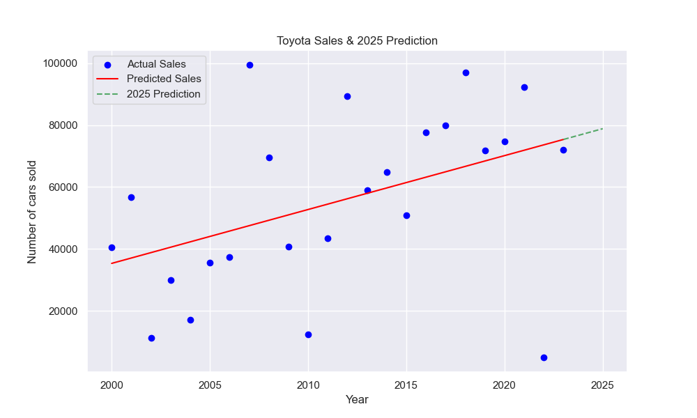
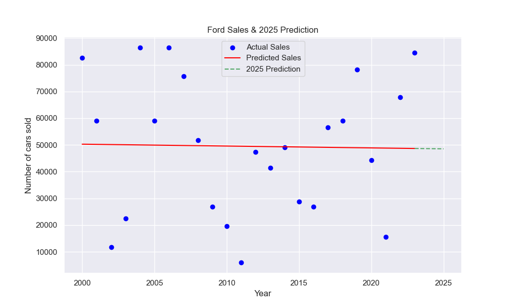

<h1 align="center">Car Sales Insight</h1>

This project analyzes car sales data from 2000 to 2024 for multiple car brands, predicts 2025 sales using linear regression, and visualizes the results.

## Visualization

<table><tr><td>
    <h3 align="center">Toyota Sales and Prediction</h3> 
      
    </td><td>
    <h3 align="center">Ford Sales and Prediction</h3> 
      
</td></tr></table>

## Project Structure

```bash
.
├── data_generation.ipynb
├── cars_2000_2024.csv  
├── Insight.ipynb
├── output/                           
```

## Data and Notebooks

### 1. Dataset

**cars_2000_2024.csv**: Contains yearly sales data for 18 car brands from 2000 to 2024.
**Columns:**
- `Year`: Year of sales (2000–2024)
- `Car brand`: Brand name (e.g., Toyota, Ford)
- `Number of Cars sold`: Number of cars sold that year

### 2. Data Generation

- Generates synthetic car sales data for each brand and year
- Defines car brands and years
- Randomly generates sales numbers
- Saves the data to `cars_2000_2024.csv`

### 3. Insight

- Loads the dataset, performs analysis, fits linear regression models, predicts 2025 sales, and visualizes results
- Defines `plot_sales(car_brand)` to:
    - Filter data for the selected brand
    - Fit a linear regression model (`sklearn.linear_model.LinearRegression`)
    - Predict sales for 2025
    - Plot actual vs. predicted sales and save the plot to `output/`
    - Print model metrics: intercept, coefficient, R² score, RMSE, and 2025 prediction

### 4. Output

Plots for each brand are saved in the `output/` directory:
- `output/toyota_sales_and_prediction.png`
- `output/ford_sales_and_prediction.png`

## Setup

### 1. Clone the repository

```sh
git clone https://github.com/karmaniket/CarSalesInsight.git
cd CarSalesInsight
```

### 2. Install dependencies with

```sh
pip install numpy pandas scikit-learn matplotlib seaborn
```

### 3. Requirements

```sh
 Python 3.8+
 Jupyter Notebook
```

## How to Run

### 1. Generate Data

Open and run all cells in [data_generation.ipynb](data_generation.ipynb).

### 2. Analyze and Visualize

Open [Insight.ipynb](Insight.ipynb) and run all cells to see data analysis, model metrics, and output plots.

### 3. Customization

- To analyze a different brand, call `plot_sales('brand_name')` in `Insight.ipynb`
- To add more brands or years, modify `data_generation.ipynb` and regenerate the CSV

```python
    plot_sales('toyota')
    plot_sales('ford')
```
